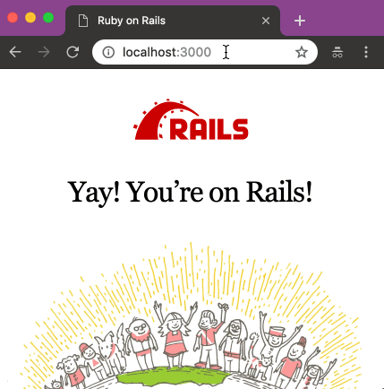

# Heaven's Door

A tiny Rails engine that generates capybara test scenario by recording browser operation in development env.


## Installation

Add this line to your Rails application's Gemfile (in most cases, for development group only):

```ruby
gem 'heavens_door', group: :development
```

Enable running of unsafe scripts via Application Controller

```ruby
content_security_policy false
```

> Please not this code should _not_ be committed and be left in place only when generating test scripts in development mode. If this code is pushed to production it will open out your site to attacks.


## Usage




### Start Recording
Visit your development app with your browser, then click the ⏺ button on the top right.


### Generate Scenarios
Just manipulate the browser, like fill-in the forms and submit, or click the links.
Your operations will be recorded on the browser.

### Copy to Clipboard
You can export the operations as a Capybara test scenario script by clicking the 📋 button.

### Stop Recording
To stop recording and clear the whole recorded scenario, click the ⏹ button.


## Requirements
- Rails
- Modern browsers


## Contributing

Pull requests are welcome on GitHub at https://github.com/amatsuda/heavens_door.


## TODO

- Insert assertions from the browser

- Some kinds of input (like time\_field, datetime\_field) might not be working properly

- Hotkeys to hide/show the panel

- Better UI

- Cleaner JS code

- Tests (do we really need tests for this? Well, maybe...)

- etcetcetc.


## License

The gem is available as open source under the terms of the [MIT License](https://opensource.org/licenses/MIT).
